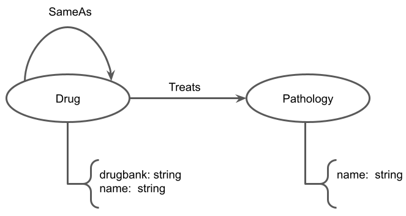
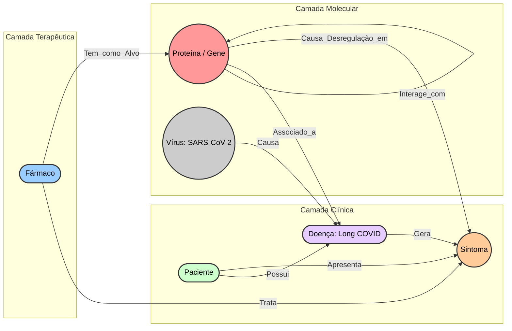

### P1 - Primeira Entrega

### Projeto Identificação de Hub Genes na Rede Proteômica de Long COVID
### Project Identification of Hub Genes in the Proteomics Network of Long COVID

### Descrição Resumida do Projeto
O projeto tem como foco o estudo das redes Proteômicas associadas às sequelas pós-COVID-19, condição crônica também conhecida como Long COVID ou PASC (Post-Acute Sequelae of SARS-CoV-2 infection). Estima-se que uma parcela significativa dos sobreviventes da COVID-19 sofra com sintomas persistentes e multissistêmicos, gerando alta morbidade e evidenciando a necessidade de análise de big data em saúde. Diante da complexidade da síndrome, que engloba sintomas neurológicos, cardiovasculares, respiratórios e imunológicos, o projeto propõe utilizar a ciência de redes para entender a fisiopatologia por trás da doença. Através da análise das interações proteína-proteína (PPI), o estudo busca mapear as conexões biomoleculares da doença para encontrar nós de alta conectividade que justifiquem a diversidade fenotípica observada nos pacientes.

### Slides
[Apresentação P1 - Definição e Planejamento](assets/slides/slide.md)

### Fundamentação Teórica
A síndrome pós-COVID-19 exige abordagens baseadas em biologia de sistemas para investigar os variados espectros clínicos da doença, integrando camadas de dados genômicos, transcriptômicos e proteômicos. Artigos recentes apontam que a análise de redes de interação proteína-proteína (PPI) aliada à topologia de grafos permite a identificação de "hub genes" ou proteínas de influência central, revelando alvos reguladores cruciais associados a inflamações persistentes e à disfunção celular. Trabalhos empregando proteômica e *frameworks* de inferência causal já demonstraram que genes como *TP53*, *CREBBP* e *SMAD3* agem como controladores da rede (network drivers) no Long COVID, enquanto outros sinalizam a presença ininterrupta de desregulação nos mecanismos de reparo e inflamação celular. Desta forma, modelar a rede genética permitirá a descoberta de caminhos metabólicos e possíveis biomarcadores para tratamentos de precisão.

### Perguntas de Pesquisa
**Quais proteínas atuam como nós centrais de alta influência (hub genes) na rede de interação de pacientes sintomáticos no estágio pós-COVID-19 ?**

### Bases de Dados
| Nome da Base | URL | Resumo Descritivo |
| :--- | :--- | :--- |
| **STRING-DB** | https://string-db.org/ | Plataforma e banco de dados dedicada à recuperação de redes de interação proteína-proteína (PPI), que será utilizada para extrair a rede biológica de proteínas relacionadas à COVID-19. |
| **NIH RECOVER** | https://recovercovid.org/ | Coorte e base clínica dedicada ao estudo profundo dos fenótipos das sequelas pós-COVID-19 em adultos e crianças, que poderá fornecer suporte para cruzar dados clínicos com os módulos genéticos encontrados. |
| **GEO (Gene Expression Omnibus)** | https://www.ncbi.nlm.nih.gov/geo/ | Banco de dados que armazena dados de transcrições e perfis de expressão (ex: bulk e *single-cell* RNA-seq), útil para validar as informações de pacientes nos estágios pós-COVID. |

### Modelo Lógico
Abaixo encontra-se a ilustração do Modelo Lógico em Grafo de Propriedades, detalhando como se darão as conexões entre nossos principais nós (como Proteínas, Fármacos, Sintomas) e os seus relacionamentos ou arestas (Interage_com, Causa, Trata):

# --- Modelo Template Início+- ( revisar)

## Legenda
### Nós (Entidades):

1. Proteína / Gene: Representa os "hub genes" e as proteínas mapeadas através da base STRING-DB.
2. Fármaco: Representa as possíveis intervenções terapêuticas
3. Sintoma: Representa os espectros fenotípicos experimentados no estágio pós-COVID-19 (ex: neurológicos, fadiga, etc.)
4. Vírus (SARS-CoV-2), Paciente e Doença: Adicionados para estruturar adequadamente as dependências da doença.

### Arestas (Relacionamentos):

1. Interage_com: Descreve a rede de Interação Proteína-Proteína (PPI) central do projeto
2. Causa: Conecta a infecção viral à síndrome do Long COVID
3. Trata: Conecta os fármacos aos sintomas que visam mitigar
4. Tem_como_Alvo / Associado_a: Ligam a camada molecular (proteínas/genes) com a doença e a camada terapêutica, respondendo à premissa do estudo

# --- Fim  Modelo Template +- ( revisar)

### Metodologia
O fluxo metodológico será baseado no uso da **Ciência de Redes** para investigar grafos interativos. Utilizando a base extraída, o foco será empregar técnicas de **análise de centralidade** (como grau, autovetor, intermediação e *closeness*) para descobrir os principais *hub genes* das sequelas da doença, mapeando o impacto de sua desregulação na expressão gênica e formação de reações em cascata no hospedeiro. Paralelamente, utilizaremos a **detecção de comunidades** para segmentar a rede complexa em *clusters* funcionais, o que nos ajudará a correlacionar grupos específicos de proteínas fortemente interligadas a classes particulares de sintomas experimentados por pacientes.

### Ferramentas
*   **Bancos de Dados:** STRING-DB e repositórios acadêmicos.
*   **Bibliotecas e Softwares Analíticos:** Python (com suporte de bibliotecas de manipulação e grafos) e R.
*   **Visualização de Redes:** Softwares de visualização como o Cytoscape (usado amplamente para visualizar as redes moleculares e calcular os parâmetros topológicos).
*   **Gestão do Conhecimento:** Padronização com o uso do Zotero integrado ao Obsidian para o controle e a sincronização das referências da literatura entre todos os membros da equipe.

### Referências Bibliográficas
1. J. Sun et al., “A multi-omics strategy to understand PASC through the RECOVER cohorts: a paradigm for a systems biology approach to the study of chronic conditions,” *Front. Syst. Biol.*, vol. 4, p. 1422384, Jan. 2025, doi: 10.3389/fsysb.2024.1422384.
2. S. Pinero et al., “Integrative Multi-Omics Framework for Causal Gene Discovery in Long COVID,” *PLoS Comput Biol*, Feb. 2025, doi: 10.1371/journal.pcbi.1013725.
3. M. Zoodsma et al., “Targeted proteomics identifies circulating biomarkers associated with active COVID-19 and post-COVID-19,” *Front. Immunol.*, vol. 13, p. 1027122, Nov. 2022, doi: 10.3389/fimmu.2022.1027122.
4. Z. Liu et al., “Identification and evaluation of candidate COVID-19 critical genes and medicinal drugs related to plasma cells,” *BMC Infectious Diseases*, vol. 24, p. 1099, 2024, doi: 10.1186/s12879-024-10000-3.
5. G. S. Carnivali, “Analisando características da rede genética gerada por genes vinculados ao Covid-19,” *IAJMH*, vol. 3, pp. 1–7, Apr. 2020, doi: 10.31005/iajmh.v3i0.97.
6. G. S. Carnivali, “STUDY on the INTERACTIONS BETWEEN GENES LINKED to COVID-19 and GENES EXPRESSED in the HUMAN BODY,” *J Proteomics Bioinform*, vol. 14, p. 254, Sep. 2021.