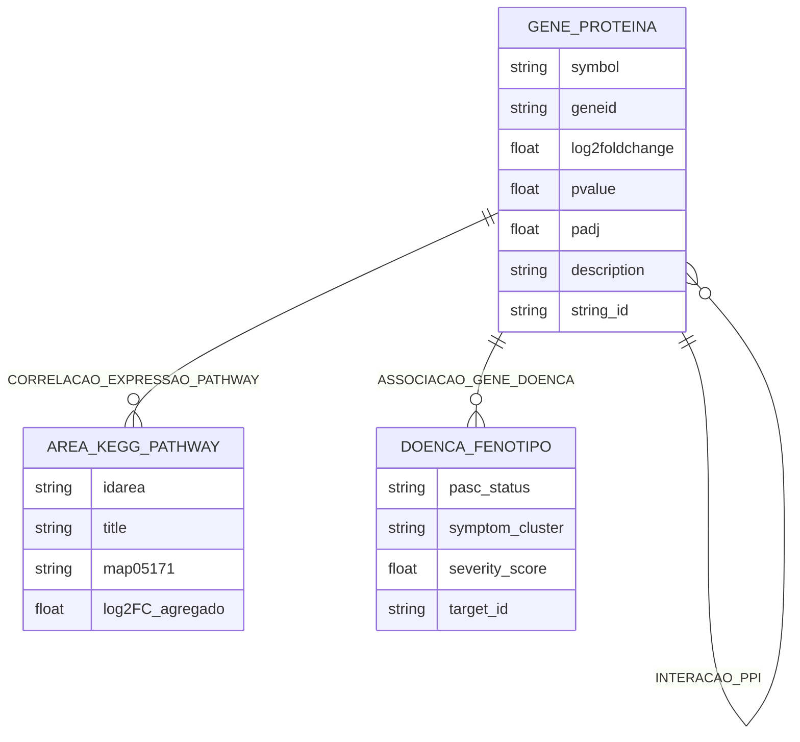
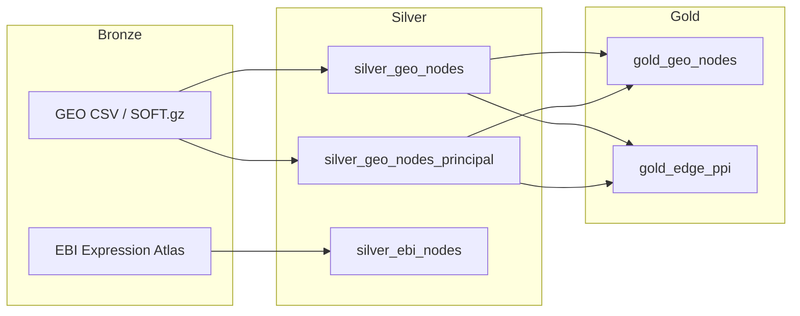

# Projeto Integração Multi-ômica de Expressão Gênica (GSE251849/GSE275334) e Redes PPI em Long COVID
# Project Multi-Omics Integration of Gene Expression (GSE251849/GSE275334) and PPI Networks in Long COVID

# Descrição Resumida do Projeto

A Long COVID (PASC) permanece como um desafio clínico e epidemiológico de grande magnitude, com manifestações persistentes que variam de fadiga crônica a disfunção imunológica e inflamatória sistêmica. Nesse contexto, a disponibilização pública de conjuntos transcriptômicos no NCBI GEO — em especial GSE251849 e GSE275334 — possibilita investigar alterações de expressão gênica em coortes relacionadas à infecção por SARS-CoV-2 e suas sequelas.

O problema central abordado consiste em integrar, de forma reprodutível e escalável, dados de expressão diferencial, metadados clínicos e interações proteína-proteína (PPI) dispersos em repositórios heterogêneos, superando a fragmentação de identificadores (Entrez Gene ID, símbolos HGNC, IDs Ensembl/STRING) e formatos distintos (SOFT comprimido, CSV tabular, TSV da Expression Atlas).

A motivação do projeto decorre da necessidade de identificar genes hub e vias biológicas associadas à Long COVID, transformando volumes extensos de dados brutos — 15.996 genes em GSE251849 e 635 em GSE275334 — em representações de rede interpretáveis por pesquisadores e clínicos, conforme abordagens de biologia de sistemas.

A relevância reside na capacidade de priorizar biomarcadores candidatos (como IL1B, ICAM1, EGF, SELP e PF4, identificados por centralidade de autovetor no Cytoscape) e de mapear esses achados sobre vias KEGG, em particular o map05171 (*Coronavirus disease*), conectando achados moleculares a fenótipos clínicos documentados em bases complementares (NIH, OpenTargets).

Trabalhos relacionados incluem estratégias multi-ômicas para PASC no cohort RECOVER (Sun et al., 2025), frameworks integrativos para descoberta causal de genes em Long COVID (Pinero et al., 2025) e estudos de proteômica direcionada a biomarcadores pós-COVID-19 (Zoodsma et al., 2022), que fundamentam o uso de grafos de interação e enriquecimento de pathways como ferramentas de síntese em biologia de sistemas.

A análise proposta combina uma arquitetura Medallion (Bronze → Silver → Gold) orquestrada pelo Apache Airflow, construção de redes PPI via API STRING-DB (score combinado ≥ 400), métricas de centralidade (autovetor) e correlação de log2 fold change com áreas do pathway KEGG map05171 no aplicativo [`Airflow/pathwayApp/`](Airflow/pathwayApp/).

Os resultados alcançados incluem 16.631 registros consolidados na camada Silver, 278 genes no cruzamento Gold (inner join GEO × NOS0001), 4.653 arestas PPI deduplicadas abrangendo 5.149 nós, 73 genes correlacionados a 113 áreas do map05171, e visualizações interativas em HTML 2D/3D e no projeto Cytoscape [`Cytoscape/TrabalhoP3v2.cys`](Cytoscape/TrabalhoP3v2.cys), com 2.929 genes significativos (p < 0,05) nas séries GEO processadas.

# Estrutura do Repositório

```text
project3-final/
├── README.md
├── assets/
│   ├── images/modelo-logico-grafos.png
│   └── Slides/
├── Airflow/              # pipeline Medallion, dados e pathwayApp
│   ├── dags/
│   ├── data/
│   └── pathwayApp/
└── Cytoscape/            # sessão TrabalhoP3v2.cys
```

| Módulo | Documentação |
|--------|--------------|
| [`Airflow/`](Airflow/) | Instalação, DAG `medallion_sample_pipeline` e camadas de dados |
| [`Cytoscape/`](Cytoscape/) | Rede PPI, filtros e centralidade de autovetor |
| [`assets/`](assets/) | Slides e modelo lógico em grafo |

# Slides

[Apresentação P3](assets/Slides/Project%203%20-%20Slides.pdf)

# Fundamentação Teórica

A biologia de sistemas modela processos biológicos como grafos \(G = (V, E)\), em que vértices \(V\) representam entidades moleculares (genes, proteínas, doenças) e arestas \(E\) capturam relações funcionais — interações PPI, coexpressão ou associação gene-doença. Métricas de centralidade, como grau, betweenness e autovetor (eigenvector), quantificam a importância topológica de um nó na propagação de sinal biológico; genes hub tendem a concentrar funções imunológicas e inflamatórias críticas em redes de Long COVID.

A integração multi-ômica alinha camadas transcriptômicas (GEO, EBI Expression Atlas), proteômicas (via STRING-DB) e clínico-fenotípicas (NIH, OpenTargets), exigindo harmonização semântica de identificadores e metadados. O enriquecimento de pathways — aqui exemplificado pelo map05171 da KEGG — permite contextualizar genes diferencialmente expressos dentro de cascatas virais, de resposta imune e de sinalização inflamatória, complementando a visão de rede global por uma leitura funcional orientada a vias.

# Perguntas de Pesquisa

**Quais proteínas atuam como nós centrais de alta influência (hub genes) na rede de interação de pacientes sintomáticos no estágio pós-COVID-19 ?**

O pipeline Medallion, a consulta STRING-DB e os scripts de correlação em [`Airflow/pathwayApp/`](Airflow/pathwayApp/) foram desenvolvidos para responder objetivamente a essas perguntas, produzindo tabelas Gold auditáveis e visualizações reprodutíveis.

# Metodologia

O pipeline ETL foi implementado como DAG `medallion_sample_pipeline` no Apache Airflow ([`Airflow/`](Airflow/)), com dependências explícitas entre tasks Bronze, Silver e Gold. Na camada Bronze, CSVs brutos de GEO (`Airflow/data/raw/geo/`) recebem carimbo `ingested_at`; arquivos `.soft.gz` são parseados por [`Airflow/dags/utils/parse_soft_file.py`](Airflow/dags/utils/parse_soft_file.py) em estrutura tabular de amostras; a Expression Atlas (EBI) é ingerida via API REST (`ebisearch` + `gxa/json/experiments`). Na Silver, [`Airflow/dags/utils/data_cleaners.py`](Airflow/dags/utils/data_cleaners.py) normaliza tokens nulos, deduplica registros, padroniza colunas DESeq2/limma (`log2FoldChange` → `log2foldchange`) e extrai metadados clínicos de `characteristics_ch1`. Na Gold, [`Airflow/dags/medallion/gold/gold.py`](Airflow/dags/medallion/gold/gold.py) realiza inner join por `geneid` entre `silver_geo_nodes` e `silver_geo_nodes_principal`; [`Airflow/dags/medallion/gold/gold_edge_ppi.py`](Airflow/dags/medallion/gold/gold_edge_ppi.py) resolve IDs no STRING-DB (chunks de 250 genes, score mínimo 400) e deduplica arestas por par canônico de STRING IDs.

Métricas de redes complexas aplicadas incluem: (i) centralidade de autovetor no Cytoscape sobre sub-rede filtrada (p < 0,05, |FC| > 1), identificando IL1B, ICAM1, EGF, SELP e PF4 como candidatos hub; (ii) score combinado STRING (`combined_score`, média 0,613 na rede GEO completa) decomposto em evidências experimental, de base de dados e text mining; (iii) agregação de log2 fold change por área KEGG (`load_log2_by_area`) para colorização do map05171. A orquestração Airflow garante rastreabilidade entre camadas e reexecução idempotente.

## Bases de Dados e Evolução

Base de Dados | Endereço na Web | Resumo descritivo
----- | ----- | -----
NCBI GEO (GSE251849, GSE275334, NOS0001) | https://www.ncbi.nlm.nih.gov/geo/ | Repositório de expressão gênica por microarray/RNA-seq. GSE251849 contém 15.996 genes com estatísticas DESeq2; GSE275334 agrega 635 genes; NOS0001 fornece 278 genes principais para cruzamento Gold.
EBI Expression Atlas | https://www.ebi.ac.uk/gxa/ | Atlas público de expressão gênica com API REST. Ingestão automatizada ([`Airflow/dags/medallion/bronze/bronze_ebi.py`](Airflow/dags/medallion/bronze/bronze_ebi.py)) de experimentos humanos relacionados a SARS-CoV-2, gerando 1.133 linhas Bronze e 1.007 registros Silver deduplicados.
OpenTargets Platform | https://platform.opentargets.org/ | Base de associações gene-doença e evidências de target druggability, utilizada como referência para contextualizar genes hub identificados na rede PPI em relação a doenças e fenótipos de Long COVID.
NIH (metadados clínicos PASC) | https://www.nih.gov/ | Conjunto complementar `Airflow/data/raw/nih/NIH.csv` com variáveis clínicas (status PASC, clusters de sintomas, severity_score, dias pós-infecção) para enriquecimento interpretativo dos achados de expressão.

**NCBI GEO.** Os arquivos brutos incluem CSVs tabulares por gene e famílias SOFT comprimidas (`GSE251849_family.soft.gz`, `GSE275334_family.soft.gz`) em `Airflow/data/raw/geo/`. Na Bronze, cada CSV recebe `ingested_at`; o parser SOFT extrai metadados de amostra (`sample_id`, `characteristics_ch1`, `source_name_ch1`). Na Silver, `clean_geo_gene_dataset` harmoniza nomes de colunas, converte campos numéricos e consolida GSE251849 e GSE275334 em `Airflow/data/silver/silver_geo_nodes.csv` (16.631 linhas, 16.065 símbolos únicos). `clean_geo_nos_nodes_dataset` filtra entradas sem descrição ou contendo *uncharacterized*/*tRNA*, produzindo `Airflow/data/silver/silver_geo_nodes_principal.csv` (278 genes).

**EBI Expression Atlas.** A task `bronze_ebi_gxa_ingest` descobre experimentos via `ebisearch`, filtra *Homo sapiens*, baixa matrizes TSV e normaliza colunas (`gene_id`, `gene_name`, `comparison_label`, `expression_value`). Na Silver, linhas sem campos obrigatórios são removidas, duplicatas eliminadas por `(experiment_accession, gene_id, comparison_label)` e valores convertidos para numérico (`expression_value_numeric`).

**OpenTargets e NIH.** OpenTargets subsidia a interpretação clínica de genes hub (associações gene-doença, scores de evidência), enquanto o CSV NIH permite cruzar achados moleculares com fenótipos PASC documentados. A integração plena dessas fontes na camada Gold permanece como extensão natural do inner join já implementado entre GEO e NOS0001.

## Modelo Lógico

O grafo de propriedades modela entidades biológicas como nós tipados e relações como arestas ponderadas. Nós principais: **Gene/Proteína** (atributos: `symbol`, `geneid`, `log2foldchange`, `pvalue`, `padj`, `description`) e **Doença/Fenótipo** (atributos clínicos derivados de NIH/OpenTargets). Arestas: **Interação PPI** (atributos: `combined_score`, `experimentally_determined_interaction`, `database_annotated`, `automated_textmining`) e **Correlação de expressão em pathway** (atributos: `idarea`, `title` KEGG, `log2foldchange` agregado por área).




**Atributos das arestas**

| Relação | Atributos | Fonte |
|---------|-----------|-------|
| `INTERACAO_PPI` | `combined_score`, `experimentally_determined_interaction`, `database_annotated`, `automated_textmining`, `node1_string_id`, `node2_string_id` | STRING-DB → `Airflow/data/gold/gold_edge_ppi.csv` |
| `CORRELACAO_EXPRESSAO_PATHWAY` | `idarea`, `title`, `log2foldchange` | KEGG map05171 → `Airflow/pathwayApp/silver_pathway_areasv1.csv` |
| `ASSOCIACAO_GENE_DOENCA` | evidências clínicas e de target | NIH · OpenTargets |

**Camadas de materialização (Medallion)**



Harmonização de identificadores: Entrez (`geneid`) · HGNC (`symbol`) · Ensembl/STRING (`9606.ENSP…`) · KEGG (`K#####`).

## Integração entre Bases

O principal desafio técnico consistiu em unificar identificadores de genes entre sistemas distintos: Entrez Gene ID (`geneid`) nos CSVs GEO, símbolos HGNC (`symbol`), IDs Ensembl retornados pela STRING-DB (`9606.ENSP...`) e identificadores KEGG nos títulos das áreas do map05171 (`K##### (SYMBOL)`). O módulo [`Airflow/dags/medallion/gold/gold_edge_ppi.py`](Airflow/dags/medallion/gold/gold_edge_ppi.py) implementa resolução em duas etapas (geneid, fallback por symbol) com chunking para respeitar limites da API STRING. A orquestração Airflow serializa dependências (Bronze → Silver → Gold PPI) e isola falhas por task, enquanto [`Airflow/dags/utils/data_cleaners.py`](Airflow/dags/utils/data_cleaners.py) garante schema uniforme antes dos cruzamentos. O join Gold GEO × NOS0001 por `geneid` reduz o universo analítico a 278 genes com evidência convergente entre séries.

## Análises Realizadas

Foram conduzidas três linhas analíticas principais: (1) estatística descritiva da expressão diferencial nas camadas Silver/Gold (intervalo de log2FC: −5,997 a 3,129; 2.929 genes com p < 0,05); (2) construção e filtragem de rede PPI no Cytoscape ([`Cytoscape/TrabalhoP3v2.cys`](Cytoscape/TrabalhoP3v2.cys)) — 5.149 nós e 4.653 arestas na rede GEO completa, com sub-rede filtrada para análise de centralidade de autovetor; (3) correlação gene-pathway via regex sobre títulos KEGG, gerando `Airflow/pathwayApp/silver_pathway_areasv1.csv` (73 genes, 113 áreas) e visualização com gradiente log2FC sobre `Airflow/pathwayApp/map05171@2x_20260606_220006.png`.

A construção de arestas PPI via STRING-DB segue o fluxo abaixo, com deduplicação por par canônico de IDs e retenção do maior `combined_score`:

~~~python
params = {
    "identifiers": "\r".join(chunk_ids),
    "species": STRING_SPECIES_HUMAN,
    "required_score": required_score,
}
payload = _string_get(session, "network", params=params)
dedup_rows = _deduplicate_rows(
    raw_rows,
    {gene.string_id: gene.geneid for gene in resolved_genes},
)
~~~

Para o pathway map05171, o log2 fold change médio por área KEGG alimenta o overlay SVG interativo:

~~~python
def load_log2_by_area(csv_path: Path) -> dict[str, float]:
    buckets: dict[str, list[float]] = defaultdict(list)
    with csv_path.open(newline="", encoding="utf-8") as handle:
        for row in csv.DictReader(handle):
            buckets[row["idarea"]].append(float(row["log2foldchange"]))
    return {area_id: sum(values) / len(values) for area_id, values in buckets.items()}
~~~

## Evolução do Projeto

A evolução iniciou-se com ingestão manual de CSVs GEO e exploração ad hoc em notebooks (`Airflow/dags/medallion/bronze/bronze_geo.ipynb`, `Airflow/dags/medallion/silver/silver_geo_nodes.ipynb`). A modelagem passou por três refinamentos: (i) adoção da arquitetura Medallion com separação Bronze/Silver/Gold; (ii) automação completa via DAG Airflow `medallion_sample_pipeline` com tasks PythonOperator; (iii) extensão analítica com API STRING-DB, correlação KEGG em [`Airflow/pathwayApp/`](Airflow/pathwayApp/) e visualização 3D ([`Airflow/pathwayApp/pathwaylog2foldchange3d.html`](Airflow/pathwayApp/pathwaylog2foldchange3d.html)). Dificuldades incluíram heterogeneidade de colunas entre séries DESeq2/limma, mapeamento parcial de genes no STRING (278 mapeados → 161 arestas PPI na sub-rede principal versus 4.653 na rede GEO expandida) e normalização de metadados SOFT multi-valor (`||`). Lições aprendidas: chunking de APIs externas, deduplicação canônica de arestas e manutenção de schema explícito em `Airflow/dags/utils/data_cleaners.py` são essenciais para pipelines reprodutíveis em bioinformática.

# Ferramentas

| Ferramenta | Justificativa de uso |
|------------|---------------------|
| **Apache Airflow** ([`Airflow/`](Airflow/)) | Orquestração declarativa do pipeline Medallion via DAG acíclico; monitoramento de tasks, reexecução e rastreabilidade entre camadas Bronze/Silver/Gold. |
| **Docker** (opcional) | Embora a instalação local utilize pip/WSL ([`Airflow/requirements.txt`](Airflow/requirements.txt)), contêineres Docker são compatíveis para deploy reprodutível do scheduler e webserver Airflow em ambientes de equipe. |
| **Python (Pandas, requests, csv)** | Transformação tabular, limpeza de nulos, joins e consumo de APIs REST (EBI, STRING-DB); núcleo de todas as tasks do pipeline. |
| **Cytoscape** ([`Cytoscape/TrabalhoP3v2.cys`](Cytoscape/TrabalhoP3v2.cys)) | Análise visual de redes biológicas, filtros por significância estatística e cálculo de centralidade de autovetor para identificação de genes hub. |
| **pathwayApp (HTML/JS/SVG)** ([`Airflow/pathwayApp/`](Airflow/pathwayApp/)) | Visualização interativa do KEGG map05171 com overlay de log2 fold change (2D e 3D), correlacionando expressão gênica Silver/Gold com áreas funcionais da via. |
| **API REST (EBI Expression Atlas, STRING-DB, OpenTargets)** | Ingestão automatizada de expressão gênica, construção de redes PPI e consulta de associações gene-doença para enriquecimento clínico dos resultados. |

# Resultados

A consolidação multi-ômica produziu as seguintes métricas nas camadas processadas:

| Camada / Artefato | Métrica |
|-------------------|---------|
| `Airflow/data/silver/silver_geo_nodes.csv` | 16.631 registros; 16.065 símbolos únicos; 2.929 genes com p < 0,05 |
| `Airflow/data/silver/silver_geo_nodes_principal.csv` | 278 genes principais (NOS0001) |
| `Airflow/data/gold/gold_geo_nodes.csv` | 278 genes (inner join GEO × NOS) |
| `Airflow/data/gold/gold_edge_ppi_geo.csv` | 4.653 arestas PPI; 5.149 nós; score combinado médio 0,613 |
| `Airflow/data/gold/gold_edge_ppi.csv` | 161 arestas PPI (sub-rede dos 278 genes principais) |
| `Airflow/pathwayApp/silver_pathway_areasv1.csv` | 73 genes correlacionados a 113 áreas do map05171 |

Na análise de centralidade no Cytoscape (filtros: p < 0,05, |FC| > 1), cinco genes emergiram como hubs promissores: **IL1B**, **ICAM1**, **EGF**, **SELP** e **PF4**, coerentes com vias inflamatórias e de adesão celular do map05171 (*Coronavirus disease*). Genes como C5AR1 apresentaram log2FC = −1,399 (p = 0,039), indicando regulação negativa em componentes do complemento. A visualização HTML ([`Airflow/pathwayApp/pathwaylog2foldchange.html`](Airflow/pathwayApp/pathwaylog2foldchange.html)) aplica gradiente azul–vermelho sobre 113 áreas do pathway, facilitando inspeção espacial das alterações transcriptômicas. O mapa estático [`Airflow/pathwayApp/map05171@2x_20260606_220006.png`](Airflow/pathwayApp/map05171@2x_20260606_220006.png) documenta o pathway base utilizado nas correlações.

# Discussão

Os resultados corroboram parcialmente as três perguntas de pesquisa. A expressão diferencial significativa concentra-se majoritariamente em GSE251849 (15.996 genes), com GSE275334 funcionando como série complementar de validação (635 genes). A rede PPI GEO expandida (4.653 arestas) revela topologia densa compatível com resposta imune sistêmica, enquanto a sub-rede de 278 genes Gold permite foco analítico em candidatos com evidência cruzada NOS0001. A centralidade de autovetor destacou IL1B e ICAM1 — genes com associações conhecidas a inflamação e fadiga em Long COVID — validando a utilidade das métricas de rede como filtro além da estatística univariada.

A correlação com map05171 demonstra que a integração pathway-expressão captura genes imunológicos (complemento, quimiocinas, receptores virais) mesmo quando o ajuste para múltiplos testes (`padj`) é conservador. Limitações incluem: mapeamento incompleto de IDs no STRING para genes sem symbol canônico, ausência de integração Gold formalizada com OpenTargets/NIH no pipeline automatizado, e dependência de séries públicas com heterogeneidade de protocolos experimentais. A remoção de amostras associadas a *brain fog* nos filtros Cytoscape, embora tenha melhorado a legibilidade da sub-rede inflamatória, pode ter excluído sinais biologicamente relevantes para outros fenótipos PASC.

# Conclusão

O projeto implementou com sucesso um pipeline Medallion orquestrado por Apache Airflow ([`Airflow/`](Airflow/)) para integração de dados transcriptômicos (GEO GSE251849/GSE275334, EBI Expression Atlas), construção de redes PPI (STRING-DB) e visualização funcional de pathways KEGG (map05171). A infraestrutura de dados montada transforma arquivos brutos heterogêneos em camadas Silver e Gold auditáveis, habilitando análises de centralidade no Cytoscape ([`Cytoscape/`](Cytoscape/)) e overlays interativos de log2 fold change.

Os principais desafios foram a harmonização de identificadores gênicos entre repositórios, o gerenciamento de rate limits em APIs externas e a modelagem de metadados clínicos dispersos em campos SOFT multi-valor. As lições aprendidas reforçam que pipelines de bioinformática devem priorizar schemas explícitos, deduplicação determinística e separação clara entre ingestão (Bronze), qualidade (Silver) e consumo analítico (Gold).

# Trabalhos Futuros

- Implementar predição de links em redes PPI por Machine Learning (embeddings de grafos, GraphSAGE ou variacionais) para inferir interações ausentes e priorizar arestas com maior probabilidade biológica.
- Integrar formalmente OpenTargets e NIH na camada Gold via API GraphQL, enriquecendo nós de doença com evidências de target e fenótipos PASC estratificados.
- Estender o pipeline para ingestão contínua de novas séries GEO e experimentos EBI, com testes de qualidade automatizados (Great Expectations) e deploy containerizado via Docker Compose.
- Incorporar análise de enriquecimento estatístico (ORA/GSEA) automatizada sobre os genes hub identificados, complementando a visualização exploratória atual do map05171.

# Referências Bibliográficas

SUN, J. et al. A multi-omics strategy to understand PASC through the RECOVER cohorts: a paradigm for a systems biology approach to the study of chronic conditions. **Frontiers in Systems Biology**, v. 4, p. 1422384, 2025. DOI: 10.3389/fsysb.2024.1422384.

PINERO, J. et al. Integrative Multi-Omics Framework for Causal Gene Discovery in Long COVID. **PLoS Computational Biology**, 2025. DOI: 10.1371/journal.pcbi.1013725.

BARABÁSI, A.-L.; OLTVAI, Z. N. Network biology: understanding the cell's functional organization. **Nature Reviews Genetics**, v. 5, n. 2, p. 101-113, 2004. DOI: 10.1038/nrg1272.
